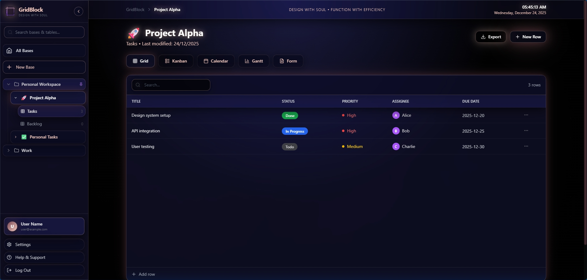

# GridBlock

**Stop Using Boring Databases**

A high-performance database application that combines the power of Baserow, the sleek aesthetic of Teable, and the free-flow content capability of Notion. Built with Next.js, Tailwind CSS, and Tiptap.




## Features

### Core Features
- **Hierarchical Organization** - Spaces → Bases → Tables → Views (inspired by Teable/NocoDB)
- **Multiple View Types** - Grid, Kanban, Calendar, Gantt, and Form views per table
- **Authentication System** - Complete login/signup flow with user profiles
- **User Profile Management** - Edit profile, bio, company, location, and preferences
- **High-Performance Database** - TanStack Table powered grid with inline editing
- **Block Editor** - Tiptap-based Notion-style editor with slash commands
- **Smart Data Management** - Automatic state persistence with localStorage
- **PDF Export** - Export your data to PDF format
- **Elegant Glassmorphic Design** - Black background with burgundy/rose gold accents
- **PWA Ready** - Install as a native app on any device
- **Fully Responsive** - Perfect on desktop, tablet, and mobile

### Data Organization
- **Spaces** - Top-level containers for organizing your work (e.g., Personal, Work)
- **Bases** - Projects or databases within spaces (e.g., Project Alpha, Marketing Tasks)
- **Tables** - Data collections within bases (e.g., Tasks, Backlog, Campaigns)
- **Views** - Different ways to visualize the same data (Grid, Kanban, Calendar, etc.)

## Design Philosophy

> "Tired of clunky databases and boring spreadsheets? So are we."

GridBlock brings together the best of modern productivity tools into one seamless experience. No bloat. No complexity. Just powerful data management with style.

## Quick Start

### Prerequisites

- Node.js 18+
- npm or yarn package manager

### Installation

1. Clone the repository:
```bash
git clone https://github.com/meyaaaaaa/gridblock.git
cd gridblock
```

2. Install dependencies:
```bash
npm install
# or
yarn install
```

3. Set up environment variables:
```bash
cp .env.example .env.local
```

Then fill in your Supabase credentials:
```env
NEXT_PUBLIC_SUPABASE_URL=your_supabase_url
NEXT_PUBLIC_SUPABASE_ANON_KEY=your_supabase_anon_key
```

4. Run the development server:
```bash
npm run dev
# or
yarn dev
```

5. Open [http://localhost:3000](http://localhost:3000) in your browser

## Project Structure

```
gridblock/
├── app/                    # Next.js app router pages
│   ├── api/               # API routes
│   ├── layout.tsx         # Root layout with providers
│   ├── page.tsx           # Main application page
│   ├── providers.tsx      # Theme provider setup
│   └── globals.css        # Global styles
├── components/            # Reusable UI components
│   ├── data/             # Data grid components
│   ├── editor/           # Block editor components
│   ├── ui/               # UI primitives
│   ├── sidebar.tsx       # Hierarchical navigation sidebar
│   ├── navbar.tsx        # Top navigation bar
│   ├── calendar-view.tsx # Calendar component
│   ├── gantt-chart.tsx   # Gantt chart component
│   └── landing-page.tsx  # Landing page component
├── lib/                   # Utility functions and services
│   ├── types.ts          # TypeScript type definitions
│   ├── initial-data.ts   # Sample data structure
│   ├── task-service.ts   # Supabase CRUD service
│   ├── supabase.ts       # Supabase client
│   ├── utils.ts          # Helper functions
│   └── validations.ts    # Zod schemas
├── public/               # Static assets
└── README.md
```

## Data Architecture

GridBlock uses a hierarchical structure inspired by Teable and NocoDB:

```
Space (Workspace/Organization)
  └─ Base (Project/Database)
      └─ Table (Data Collection)
          └─ View (Grid/Kanban/Calendar/Gantt/Form)
              └─ Records (Rows of data)
```

This structure helps prevent confusion by:
1. **Clear ownership** - Each base belongs to a specific space
2. **Progressive disclosure** - Users see complexity gradually
3. **Logical grouping** - Related tables stay together in bases
4. **View flexibility** - Same data, multiple perspectives

## Tech Stack

- **Framework**: Next.js 14+ (App Router)
- **Language**: TypeScript
- **Styling**: Tailwind CSS
- **Database**: Supabase (PostgreSQL)
- **State Management**: TanStack React Query
- **Table Engine**: TanStack Table
- **Block Editor**: Tiptap
- **Icons**: Lucide React
- **PDF Export**: jsPDF

## Roadmap

- [ ] Real-time collaboration
- [ ] Advanced filtering and views
- [ ] Custom field types
- [ ] API integrations
- [ ] Mobile app (PWA)
- [ ] Import/Export (CSV, JSON)
- [ ] Keyboard shortcuts
- [ ] Custom themes

## Contributing

Contributions are welcome! Please feel free to submit a Pull Request.

1. Fork the repository
2. Create your feature branch (`git checkout -b feature/AmazingFeature`)
3. Commit your changes (`git commit -m 'Add some AmazingFeature'`)
4. Push to the branch (`git push origin feature/AmazingFeature`)
5. Open a Pull Request

## License

This project is licensed under the MIT License - see the [LICENSE](LICENSE) file for details.

## Author

**meyaaaaaa**

- GitHub: [@me-yeatz](https://github.com/me-yeatz)

## Acknowledgments

- Inspired by Baserow, Teable, and Notion
- Built with modern web technologies
- Thanks to all contributors and users!

## Support

If you have any questions or issues, please open an issue on GitHub.

---

**Made with power and precision**
